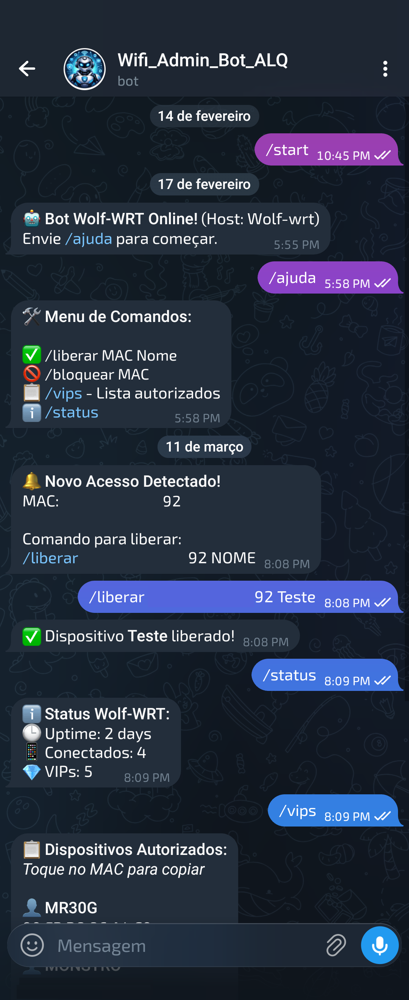
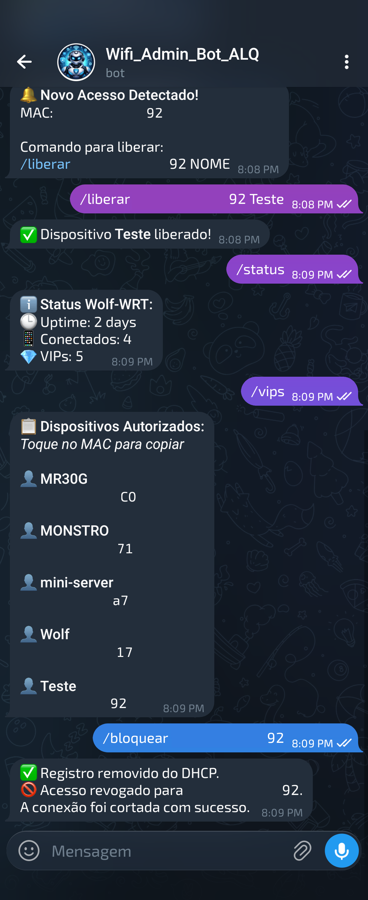
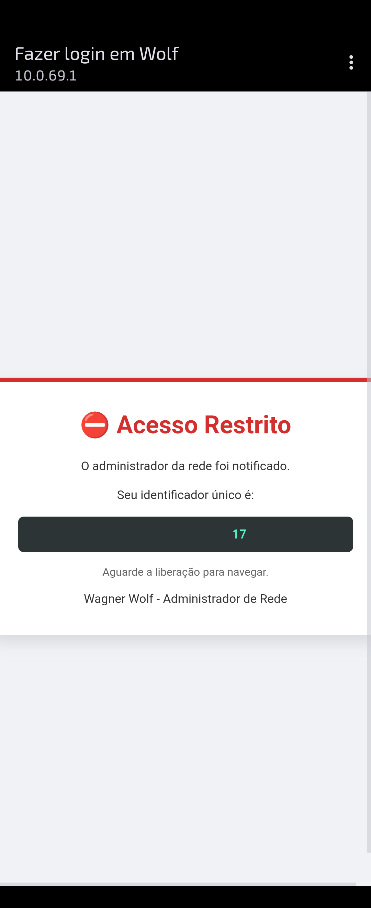

# Captive Portal Wolf-WRT
### Sistema de Controle de Acesso via Telegram + OpenNDS para OpenWrt


O **Captive Portal Wolf-WRT** é uma solução de gerenciamento de rede para roteadores baseados em **OpenWrt**.

Ele combina o poder do **Captive Portal OpenNDS** com a praticidade do **Telegram**, permitindo que o administrador **aprove ou bloqueie dispositivos em tempo real diretamente pelo celular**, sem precisar acessar a interface **LuCI** ou **SSH**.

---

# 🚀 Motivações do Projeto

Este projeto nasceu da necessidade real de **segurança e controle sobre a infraestrutura de rede**.

### 🔎 Detecção de Intrusos
A descoberta de acessos **não autorizados à rede Wi-Fi**, mesmo com o uso de senhas.

### 🛡️ Segurança em Camadas
A compreensão de que **apenas mudar a senha do roteador não é suficiente**.  
Dispositivos autorizados podem compartilhar a senha com terceiros.

### ⚡ Controle Proativo
Implementação de uma **segunda camada de segurança (Captive Portal)** que exige a aprovação explícita do administrador para cada novo dispositivo conectado.

---

# 🛠️ Funcionalidades

### 📲 Notificação em Tempo Real
Sempre que um novo dispositivo tenta acessar a rede, o administrador recebe uma mensagem no **Telegram** com o endereço **MAC** do dispositivo.

### 🚫 Filtro Anti-Spam
Sistema inteligente que evita múltiplas notificações do mesmo dispositivo em um curto intervalo de tempo.

### ✅ Aprovação Remota

```bash
/liberar <MAC> <NOME>
```

Fixa o IP do dispositivo e concede acesso permanente.

### ⛔ Bloqueio Cirúrgico

```bash
/bloquear <MAC>
```

Remove a autorização e derruba a conexão ativa imediatamente usando **conntrack**, sem reiniciar o roteador ou afetar outros usuários.

### ⭐ Lista de VIPs

```bash
/vips
```

Lista todos os dispositivos autorizados com seus respectivos nomes e endereços MAC.

---

# 🧩 Arquitetura do Sistema

```
                   Internet
                       │
                       │
                 ┌─────────────┐
                 │  OpenWrt    │
                 │  Router     │
                 └──────┬──────┘
                        │
                        │
                ┌──────────────┐
                │   OpenNDS    │
                │ CaptivePortal│
                └──────┬───────┘
                       │
                       │ Detecta novo MAC
                       │
              ┌────────▼────────┐
              │ theme_custom.sh │
              │ Notificação     │
              └────────┬────────┘
                       │
                       │ chama
                       │
               ┌───────▼────────┐
               │ bot_telegram.sh│
               └───────┬────────┘
                       │
                       │ Telegram API
                       │
                 ┌─────▼─────┐
                 │ Telegram  │
                 │   Bot     │
                 └─────┬─────┘
                       │
                       │ Comandos do Admin
                       │
                ┌──────▼───────┐
                │ sync_clients │
                │   Script     │
                └──────────────┘
```

---

# ⚙️ Instalação e Configuração

## 1️⃣ Requisitos

- Roteador compatível com **OpenWrt**
- Bot criado via **@BotFather**
- Seu **ID de usuário do Telegram**

---

## 2️⃣ Procedimento de Instalação

### 1. Acesse o roteador via SSH

```bash
ssh root@192.168.1.1
```

---

### 2. Obtenha o script de instalação

Você pode clonar o projeto diretamente ou criar o arquivo manualmente.

#### 🔹 Opção A — Via Git Clone (Recomendado)

```bash
git clone https://github.com/WagnerWolf/openwrt-captiveportal.git
cd openwrt-captiveportal
```

#### 🔹 Opção B — Via Criação Manual

```bash
vi install.sh
```

Cole o conteúdo do script e salve o arquivo.

---

### 3. Torne o script executável

```bash
chmod +x install.sh
```

---

### 4. Execute o instalador

```bash
./install.sh
```

Durante a instalação será solicitado:

- **Bot Token**
- **Chat ID do Telegram**

---

# 📁 Estrutura de Arquivos

| Arquivo | Função |
|-------|--------|
| `/root/bot_telegram.sh` | Script principal de integração com a API do Telegram |
| `/root/sync_clients.sh` | Garante que dispositivos VIPs sejam liberados automaticamente após reinicialização |
| `/etc/opennds/theme_custom.sh` | Página de bloqueio personalizada e disparador de alertas |

💡 Após a instalação, o sistema já estará integrado com:

- **OpenNDS Captive Portal**
- **Bot Telegram**
- **Sistema de sincronização de clientes VIP**

# 📋 Comandos do Bot

| Comando | Descrição |
|--------|-----------|
| `/liberar <MAC> <Nome>` | Torna o dispositivo um VIP |
| `/bloquear <MAC>` | Revoga acesso imediatamente |
| `/vips` | Lista dispositivos autorizados |
| `/status` | Mostra uptime do sistema |

---

# 🖼️ Demonstração

## 📲 Imagens do Telegram

<p align="center">
  
  
</p>

---

## 🌐 Captive Portal (OpenNDS)

<p align="center">
  
</p>

# 🔒 Segurança

Este projeto adiciona **uma camada extra de controle de acesso** sobre redes OpenWrt utilizando:

- Captive Portal
- Autorização manual por MAC
- Controle remoto via Telegram

---

# 👤 Autor

**Wagner Wolf**  
